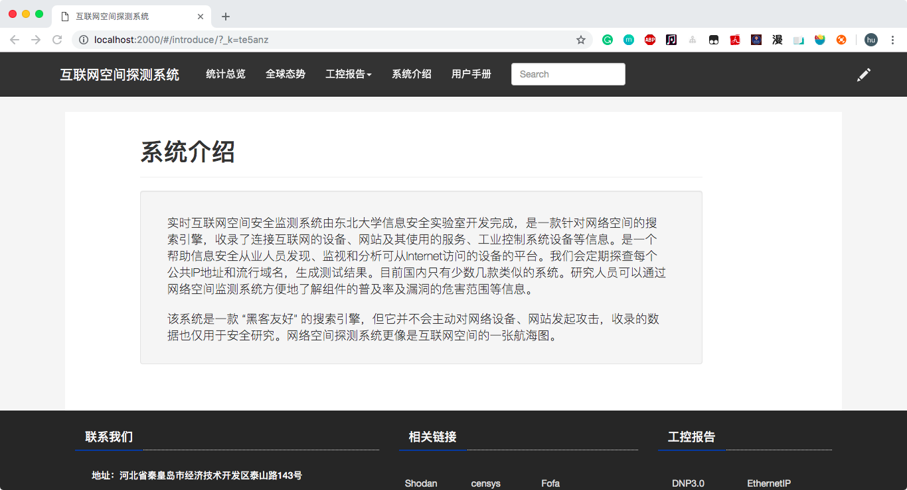
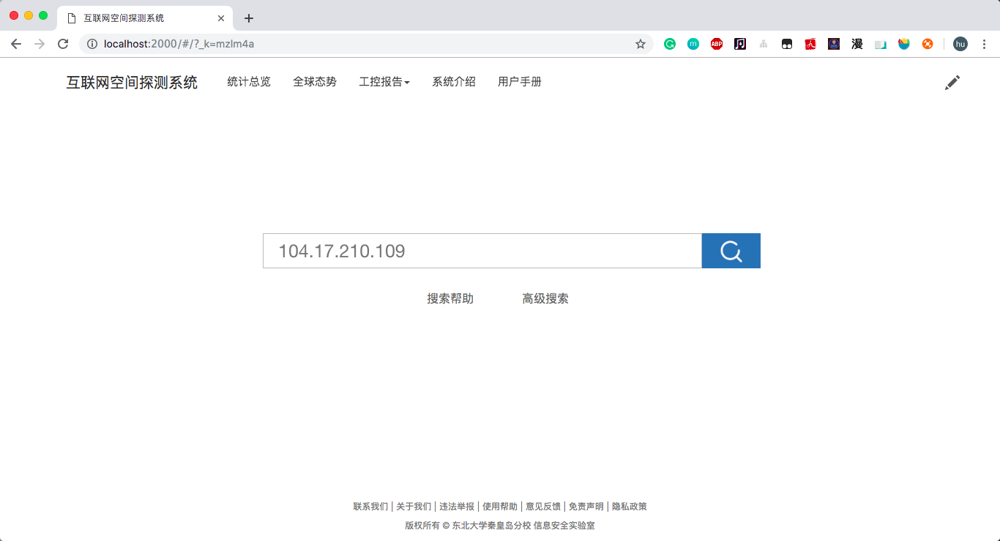
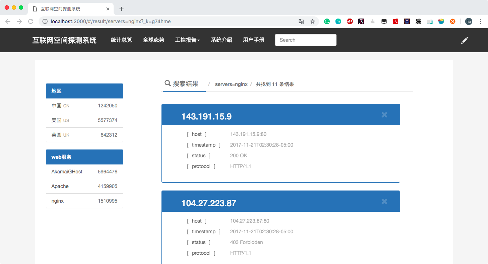
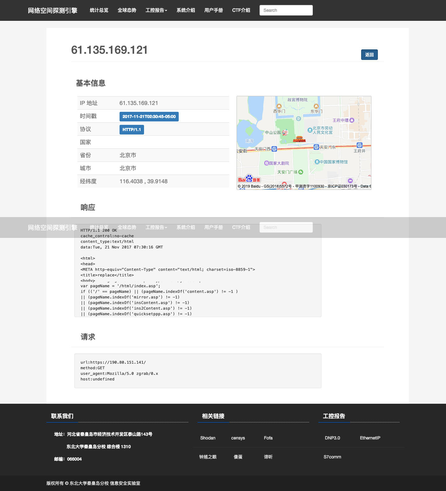
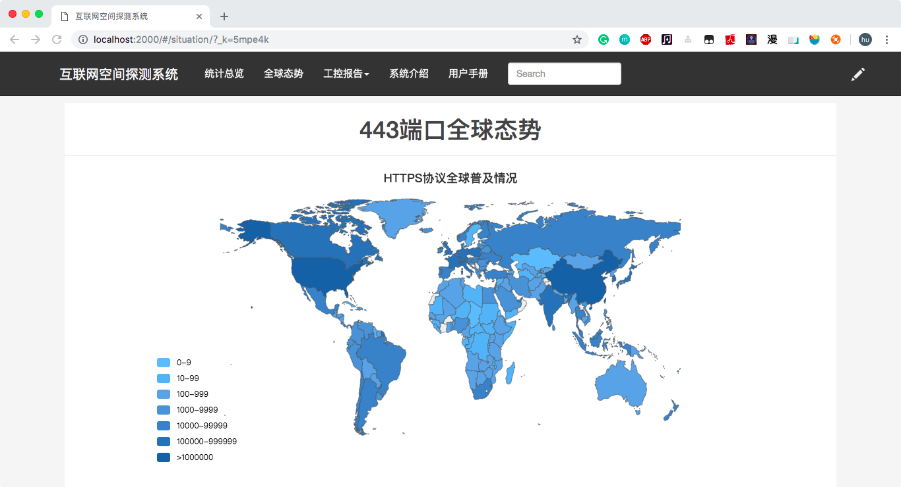
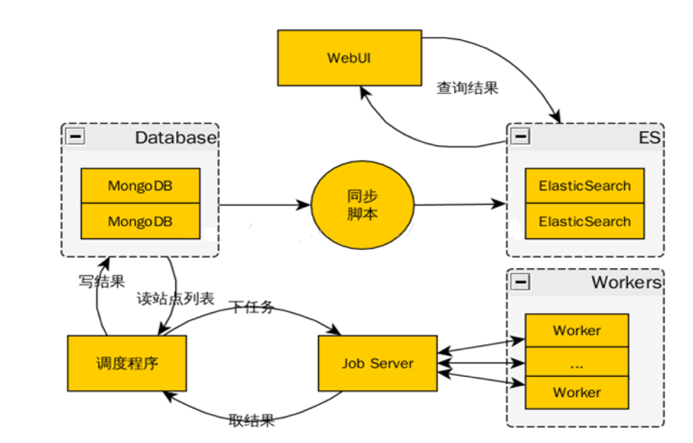

# 网络空间探测器-后端
> 爬取网络空间活动主机，提供实时查询接口

## Project Framework
- Laravel
- nginx

## Search Framework
- Redis
- ElasticSearch

## Screenshots
- 介绍

- 主页

- 查询页面

- 查询详情

- 全球态势

## Others
- 架构

## Frontend
> @extratztty [前端代码](https://github.com/extratztty/Internet-Explorer)

Authored by [@imyhui](https://github.com/imyhui/). Maintained by [@imyhui](https://github.com/imyhui/) 

[@GitHub](https://github.com/imyhui/ipsearch) · [@Blog](https://imyhui.github.io/)